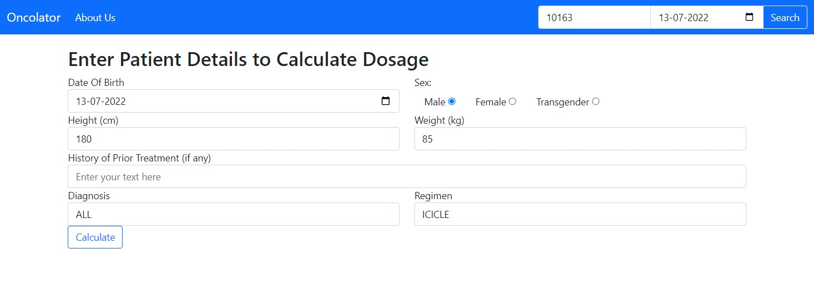
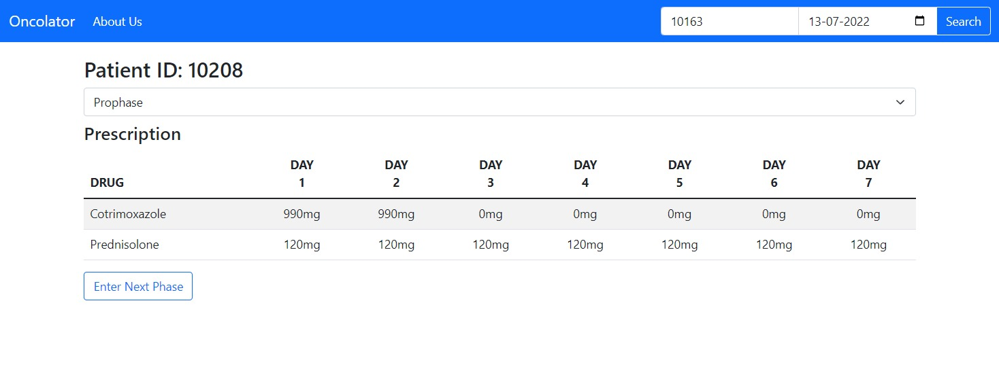
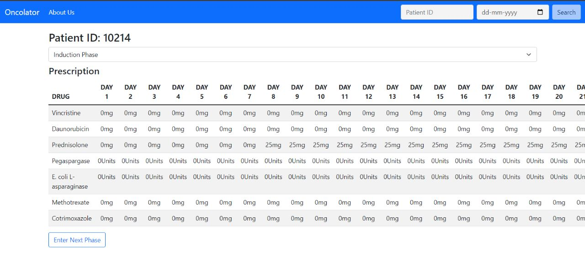

# Pediatrics Chemotherapy Dosing Calculator


## Overview


The Pediatrics Chemotherapy Dosing Calculator is a tool designed to assist healthcare professionals in determining the appropriate dosage of chemotherapy for pediatric patients. This calculator aims to streamline the dosing process, ensuring accurate and safe administration of chemotherapy drugs tailored to the unique needs of children.


## Features


- **Customizable Parameters:** Input patient-specific details such as age, weight, and medical history to calculate personalized chemotherapy dosages.
- **Drug Database:** Access a comprehensive database of chemotherapy drugs, including dosage guidelines and relevant information.
- **Real-time Updates:** Receive instant calculations and recommendations based on the latest medical guidelines.


## Getting Started

## Pre-requisites
1. Java
2. Angular.js


## Installation and Usage


1. Clone the repository:


    ```bash
    git clone https://github.com/yourusername/pediatrics-chemo-calculator.git
    ```


2. Frontend:
    ```
    npm install
    ng start
    ```


3. Backend:
    ```
    run src\main\java\com\oncolator\app\UsersApplication.java
    ```


4. The server will be accessible at ``` localhost:4200 ```


## License


This project is licensed under the MIT License - see the [LICENSE.md](LICENSE.md) file for details.


## Screenshots






